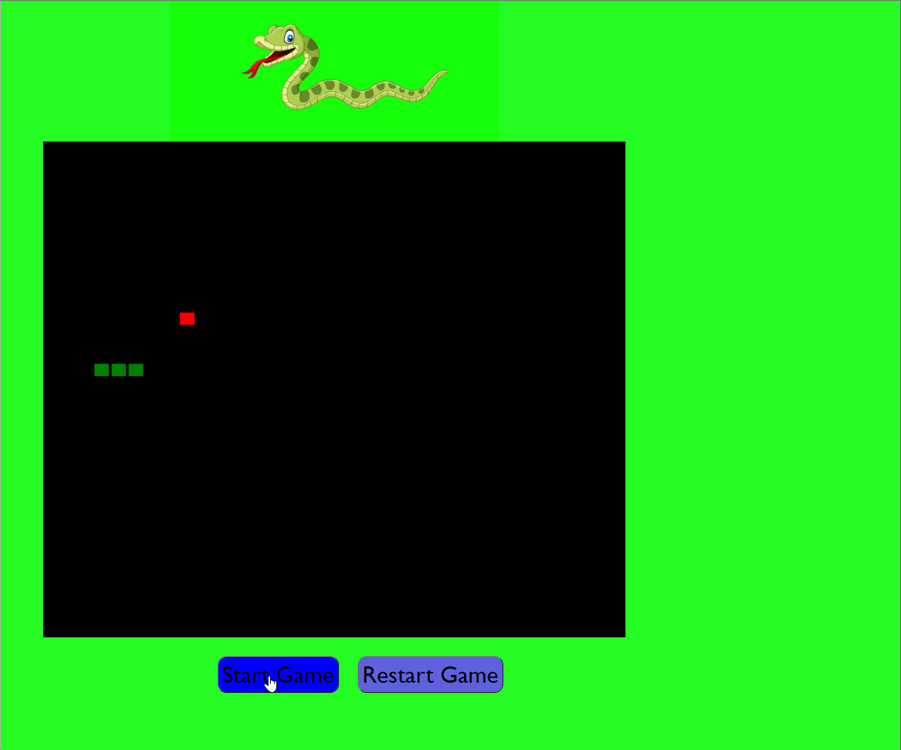

#  **Snake Game** 

#  **Overview** 

* Snake Game application is built entirely with HTML, CSS and Javascript.
* Utilized setInterval, HTML canvas and Arrays to create the snake game.

# **Website**

 Play the game ***[here](https://komalgill0310.github.io/snake_game/)***

# **Summary**

* This classic snake game helped me gain knowledge on using arrays, arrays of objects, and the importance of identifying the problem before formulating a solution. Using the step-by-step approach, I first understood the problem in my own words and then wrote the steps to solve it. Building this project was a lot of fun and I improved my JavaScript skills a lot.

* **How to play the game?** 
  * In order to begin the game, player should click on the *Start Game* button.
  * Snake will move in the right direction once the game has started.
    * To move the snake in any other direction, need to use arrow keys on the keyboard.
  * When the snake's head touches a wall, the game is over
  * When snake's head touches snake's body, the game is over
  * A player should click on the *Restart Game* button in order to restart the game.

# Author
Komal - | Software Developer | Personal website is in progress | [LinkedIn](https://www.linkedin.com/in/komalpreet-kaur-3b6924177/)